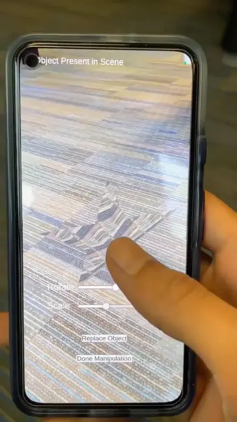
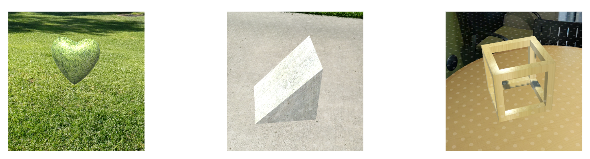

# CohesiveAR

### **Cohesive Augmented Reality Content via Concurrent Extraction and Mapping of Real-World Textures**  
*Four Eyes Lab, University of California, Santa Barbara (UCSB) | Fall 2022*

---

## 🔬 Abstract & Problem Statement
Virtual objects in standard Augmented Reality (AR) frameworks frequently exhibit a stark visual disconnect from their physical surroundings due to invariant texture profiles. This project introduces a real-time computer vision pipeline that programmatically extracts physical, real-world surface materials and maps them dynamically onto virtual target geometries. By preserving local environmental context, the framework guarantees spatial and visual cohesion across heterogeneous physical-virtual boundary layers.

*   **Context-Aware Blending:** Synthesizes local geometric and surface texturing constraints seamlessly into real-time render loops.
*   **High-Fidelity Interaction:** Mitigates perceptual shifts by matching virtual object surfaces to local ambient lighting and physical material profiles.

## 📽️ Core System Evaluation

🔗 **[Access the Full Technical Evaluation & Application Architecture Video on YouTube](https://www.youtube.com/watch?v=eUzmJmamqFk)**

---

## 📊 Experimental Results & Spatial Artifacts

*Figure 1: Performance profiles of concurrent surface extraction across heterogeneous indoor and outdoor macro-textures (San Clemente, UCSB; November 25, 2022). The pipeline evaluates geometric warping errors across diverse illumination thresholds.*

## 📐 System Infrastructure & Dependencies
*   **Graphics & Engine Architecture:** Unity Engine (Custom Render Pipelines), C#, C++ Core Engine Logic, ShaderLab
*   **Spatial Computing & Vision Libraries:** Google ARCore SDK, OpenCV (Real-Time Preprocessing Matrix Utilities)

---

## 📦 Decoupled Repository Subsystems

The source code architecture is modularly separated into specific tracking, perception, and graphics layers:

*   **[`Cohesive-AR-ARCore`](https://github.com/CohesiveAR/Cohesive-AR-ARCore)**  
    The central Unity application runtime serving as the main orchestration engine; integrates the spatial state estimation, device tracking lifecycle, and all downstream subsystem components.
*   **[`Texture-Scan`](https://github.com/CohesiveAR/Texture-Scan)**  
    Marker-based initialization arrays, surface boundary isolation scripts, and texture region-of-interest (ROI) segmentation routines.
*   **[`OpenCv-Editing-for-Image`](https://github.com/CohesiveAR/OpenCv-Editting-for-Image-)**  
    Computer vision preprocessing scenes, perspective warping matrices, and custom fragment shaders for photometric normalization.
*   **[`Manipulate-Scene-Object`](https://github.com/CohesiveAR/Manipulate-Scene-Object)**  
    Low-level C++ rendering engine logic managing affine transformations (scaling, rotation), runtime memory allocations, and dynamic UV mapping matrices.
